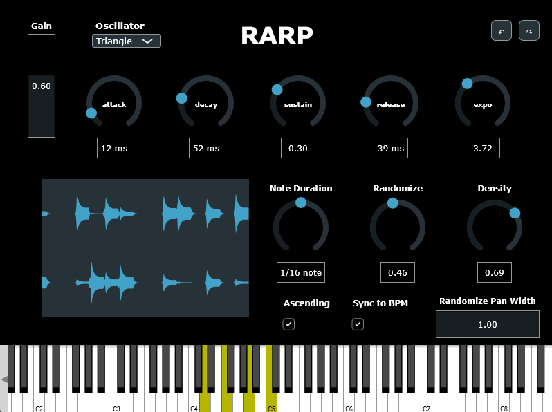

# RARP

Arpeggiator instrument plugin with 4 oscillator types, ADSR, randomn note selection and density controls, host BPM sync option, randomized panning, and waveform visualizer.

Built on JUCE

[Sample audio (with added eq, reverb, and percussion)](assets/audio/rarp.mp3)